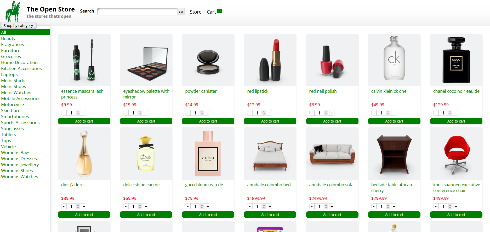

# The Open Store

A simple online store with a shopping cart, this project focuses on using react router for client-side navigation, using a custom hook to fetch the products and sharing data between pages via Outlet context. The project features a simple design that uses CSS modules

[Live Demo]<https://theopenstore.netlify.app/store>

